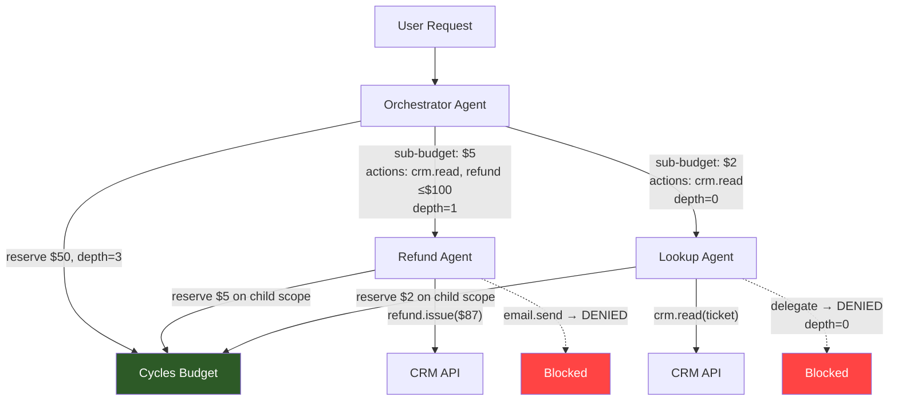

# Agent Delegation Chains Need Authority Attenuation, Not Trust Propagation

A planning agent delegates a research task to a retrieval agent. The retrieval agent delegates a web search to a browsing agent. The browsing agent calls an API with the planning agent's full credentials, its entire budget, and permission to write to any tool the parent could access. Three hops in a multi-agent delegation chain, zero scope reduction. This is how most multi-agent systems work today — and it's why a single compromised sub-agent can drain your budget, exfiltrate data, or trigger actions the original user never authorized.

<!-- more -->

DeepMind published delegation rules in February. The Cloud Security Alliance called it "the chain problem" in March. Microsoft shipped a governance toolkit this week. Everyone agrees delegation needs guardrails. Nobody has shipped the enforcement primitive that actually constrains authority at each hop.

That primitive is **authority attenuation**: every delegation boundary must narrow what the child agent can spend, do, and access — never widen it. Budget, action permissions, and data scope should decrease monotonically through the chain. This isn't a new idea in systems design (capability-based security has enforced it for decades), but the agent ecosystem has ignored it entirely.

## Why delegation chains are an authority problem, not a trust problem

The industry frames multi-agent delegation as a trust question: *can I trust Agent B to do what Agent A asked?* This framing leads to identity verification, reputation scores, and attestation chains. All useful — all insufficient.

The real question is: *even if Agent B is perfectly trustworthy, what should it be allowed to do?*

A trusted agent with excessive authority is still dangerous. It can be prompt-injected. Its tool calls can have unintended side effects. Its sub-agents can amplify a small permission into a large blast radius. Trust answers "who" — authority answers "what" and "how much."

Consider a customer support orchestrator that delegates to a refund agent:

| Property | Orchestrator | Refund Agent (current) | Refund Agent (attenuated) |
|----------|-------------|----------------------|--------------------------|
| Budget | $50.00 | $50.00 (inherited) | $5.00 (sub-budget) |
| Actions | CRM read, CRM write, email, refund | CRM read, CRM write, email, refund (inherited) | CRM read, refund ≤ $100 |
| Data scope | All customers | All customers (inherited) | Current ticket customer only |
| Delegation depth | Unlimited | Unlimited (inherited) | 0 (terminal — cannot delegate further) |

The left column is what ships today. The right column is what should ship. The difference is not trust — the refund agent is the same code either way. The difference is authority boundaries enforced at the delegation point.

## The attenuation pattern: sub-budgets, action masks, and depth limits

Authority attenuation requires three enforcement mechanisms at every delegation boundary.

### 1. Sub-budget carving

When Agent A delegates to Agent B, it reserves a portion of its own budget as Agent B's ceiling. Agent B cannot spend more than that sub-budget, regardless of what the parent has available.

```python
from cycles import CyclesClient

cycles = CyclesClient()

# Parent agent's run — $50 budget
parent_run = cycles.reserve(
    scope="tenant/acme/workflow/support/run/ticket-4821",
    amount=50_00,  # $50.00 in cents
    unit="USD_CENTS",
)

# Delegate to refund agent — carve a $5 sub-budget
refund_run = cycles.reserve(
    scope="tenant/acme/workflow/support/run/ticket-4821/delegate/refund",
    amount=5_00,  # $5.00 ceiling
    unit="USD_CENTS",
)

# The refund agent's entire world is $5.
# If it's prompt-injected into a loop, damage is capped at $5 — not $50.
```

This is not a new Cycles feature — hierarchical scopes already enforce it. The point is that **every delegation must create a child scope with a smaller budget**. The protocol handles the rest: the child scope's balance can never exceed what the parent reserved for it.

### 2. Action masks

Budget attenuation caps spend. Action masks cap capability. At each delegation boundary, the parent defines which tool calls the child is allowed to make and with what parameters.

```python
# Parent's action authority: full support toolkit
parent_actions = {
    "crm.read": {"risk_points": 1},
    "crm.write": {"risk_points": 5},
    "email.send": {"risk_points": 10},
    "refund.issue": {"risk_points": 20, "max_amount": 500},
}

# Delegated action authority: restricted subset
refund_agent_actions = {
    "crm.read": {"risk_points": 1},
    "refund.issue": {"risk_points": 20, "max_amount": 100},
    # No crm.write. No email.send. Period.
}
```

With Cycles' risk-point budgets, you can enforce this by reserving a risk-point budget for the child scope that only accommodates the allowed actions. If the refund agent attempts an `email.send` (10 risk points) but its risk-point budget only has capacity for `crm.read` + `refund.issue`, the call is denied before execution.

### 3. Depth limits

Every delegation chain needs a maximum depth. Without it, Agent B can delegate to Agent C, which delegates to Agent D, creating unbounded recursion that multiplies latency, cost, and blast radius.

```
Orchestrator (depth=3)
  └─ Refund Agent (depth=2)
       └─ CRM Lookup Agent (depth=1)
            └─ [BLOCKED — depth=0, cannot delegate]
```

Depth limits are metadata on the delegation, enforced by the runtime. If a depth-0 agent attempts to spin up a sub-agent, the runtime rejects it. No negotiation.

## What the architecture looks like

Here's the full pattern — an orchestrator delegating to two specialist agents, each with attenuated authority:



The orchestrator holds the total budget. Each delegated agent gets a carved sub-budget, a restricted action set, and a decremented depth counter. The runtime (Cycles) enforces all three — the agents themselves don't need to be aware of their constraints. A compromised or misbehaving sub-agent hits a wall, not a suggestion.

## Why the industry keeps getting this wrong

Three architectural defaults push multi-agent systems toward full trust propagation:

**1. Credential inheritance.** Most frameworks pass the parent's API keys and tool credentials to child agents by default. LangChain's agent executor and CrewAI's task delegation inherit the parent's tool configuration wholesale. AutoGen supports per-agent tool configs, but scope narrowing is manual and opt-in — the default path is full inheritance. The child agent can typically call anything the parent can call.

**2. No budget hierarchy.** Orchestration frameworks don't model budget as a hierarchical resource. There's no concept of "this sub-agent gets 10% of my remaining budget." Without hierarchical scoping, every agent in the chain competes for the same flat pool — or has no budget at all.

**3. Depth is implicit.** Delegation depth is controlled by prompt instructions ("do not delegate this task further"), not by runtime enforcement. Prompt-based depth limits fail the moment a sub-agent is jailbroken or encounters an edge case the prompt didn't anticipate.

Microsoft's new Agent Governance Toolkit addresses credential scoping and action policies, but delegates budget enforcement to external systems. DeepMind's delegation framework is a theoretical model without runtime primitives. The CSA's recommendations are policy guidance without enforcement code. Each piece is necessary; none is sufficient alone.

## Implementing attenuation today

You don't need to wait for frameworks to ship attenuation primitives. The pattern works with any runtime authority system that supports hierarchical scopes.

**Step 1: Model your delegation tree as a scope hierarchy.**

```
tenant/{tenant_id}/workflow/{workflow_id}/run/{run_id}           ← orchestrator
tenant/{tenant_id}/workflow/{workflow_id}/run/{run_id}/delegate/{agent_name}  ← child
```

**Step 2: Reserve sub-budgets at delegation time.** Before spawning a child agent, call `reserve` on the child scope with a budget that is strictly less than the parent's remaining balance.

**Step 3: Assign risk-point budgets per delegated agent.** Use risk points to cap the *type* and *count* of actions the child can perform. A refund agent with 25 risk points can issue one refund (20 points) and one CRM read (5 points) — then it's done.

**Step 4: Enforce depth in your orchestration logic.** Pass a `max_depth` counter that decrements at each delegation. At depth 0, the agent runs in terminal mode — no sub-agent creation.

**Step 5: Release unused sub-budgets.** When a delegated agent completes, release its remaining reservation back to the parent scope. This prevents budget fragmentation across deep chains.

## The Monday morning takeaway

If you're building multi-agent systems, audit your delegation boundaries this week. Ask three questions at every point where one agent spawns or calls another:

1. **Does the child agent get a smaller budget than the parent?** If not, a runaway child can drain the entire run.
2. **Does the child agent have fewer action permissions than the parent?** If not, a compromised child can do everything the parent can.
3. **Is there a hard depth limit enforced by the runtime — not by a prompt?** If not, recursive delegation can amplify any failure.

If the answer to any of these is "no," you don't have a delegation chain — you have a trust propagation chain. And trust propagation chains are one prompt injection away from an incident.

Authority should attenuate through delegation chains the same way it attenuates through capability systems, OAuth scope restrictions, and Unix process permissions: each child gets strictly less than its parent, enforced by the runtime, not by convention. The primitives exist today. The question is whether you wire them in before or after your first multi-agent incident.
