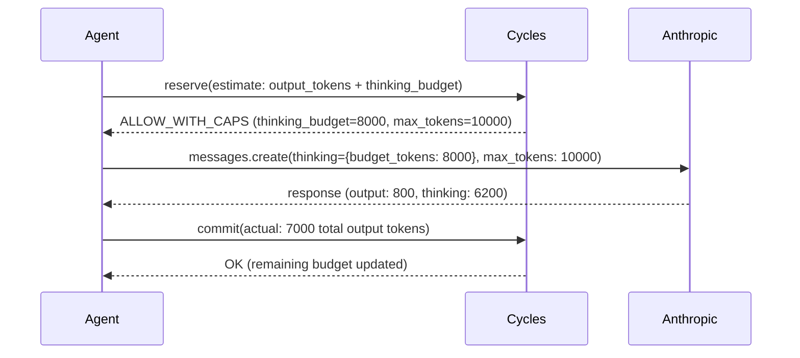

# Budgeting Reasoning Tokens: Governing Extended Thinking Before It Bills

A team migrated a triage agent from `claude-3-5-sonnet` to `claude-opus-4-6` with extended thinking enabled. Same prompts, same tools, same `max_tokens=4096`. The next morning's invoice was 7x higher. The visible outputs looked identical — short, correct, on-topic. The difference was invisible: each call produced 18,000–32,000 thinking tokens that never appeared in the UI, never touched the transcript, and billed at full output-token rates. Nobody had set a thinking-token cap because the old model didn't have one. The budget wasn't wrong. It was blind.

<!-- more -->

Reasoning models — Claude extended thinking, OpenAI o3, Gemini 2.5 thinking, DeepSeek R1 — have quietly invalidated a generation of agent cost controls. If you built your budget layer around visible output tokens, prompt length, or request count, you are now enforcing a budget that bears only loose correlation to what you actually pay. This post shows why, and how to fix it with a runtime authority layer that caps thinking spend before the model runs.

## Why reasoning tokens break existing controls

Reasoning tokens have three properties that existing governance layers don't handle:

1. **They are billed as output tokens** but never returned to the caller. On Anthropic, thinking tokens count against `max_tokens` and appear under `usage.output_tokens`. On OpenAI o-series, they appear under `usage.completion_tokens_details.reasoning_tokens`. On Gemini 2.5, they are part of the `candidatesTokenCount`. You pay for them. You can't log them as part of the response.

2. **They have 10–100x variance per call.** The same prompt with the same model can produce 400 thinking tokens one time and 40,000 the next, depending on question difficulty heuristics the model chooses internally. Unlike output tokens, you cannot bound them with a character-count estimate of the task.

3. **They are invisible to the user.** Your agent UI shows a clean four-sentence answer. Behind it, the model burned through 25,000 tokens of chain-of-thought the user never sees. Every existing observability dashboard that samples "response length" is lying to you.

The practical consequence: `max_tokens` is now a cost cap in a way it never was before. In the pre-reasoning era, `max_tokens=4096` meant "at most 4096 tokens of visible output." Today, on a reasoning model, it means "at most 4096 tokens of *anything*, thinking included" — and if you set it too low, the model truncates mid-thought and returns an empty or garbage answer. If you set it high to be safe, you've silently uncapped per-call cost by 10x.

Rate limits are worse. A 10 requests-per-minute limit on an o3 agent can still produce $40/minute in reasoning spend, because the *per-request* cost is unbounded. Provider spending caps (OpenAI org limits, Anthropic workspace caps) trip at the end of the billing window — hours or days after the damage is done. See [why provider caps aren't enough](/blog/cycles-vs-llm-proxies-and-observability-tools) for more.

## The shape of the fix: separate caps, pre-flight reservation

Governing reasoning tokens requires three things existing budget layers don't provide:

- **A thinking budget distinct from output budget**, enforced at the provider API level via `budget_tokens` (Anthropic), `reasoning_effort` (OpenAI), or `thinkingBudget` (Gemini).
- **A pre-flight reservation** sized to the *worst-case* combined token count, not the expected output length.
- **Post-hoc reconciliation** that commits the actual thinking + output tokens against the reservation, so an agent that burns its thinking budget loses budget share from the run's overall cap.

This is the runtime authority pattern: reserve → enforce → commit. It's the same pattern we apply to tool risk, delegation chains, and retry storms. Reasoning tokens are simply another dimension of exposure. For the general pattern, see [exposure: why rate limits leave agents unbounded](/concepts/exposure-why-rate-limits-leave-agents-unbounded).



The key is that Cycles returns the **enforced thinking cap** as part of the decision — the agent doesn't choose it, the governance layer does, based on remaining budget, tenant tier, and tool risk class.

## Concrete integration: Claude extended thinking

Here's the integration for Anthropic's extended thinking API. Cycles acts as the authority that decides how much reasoning the agent can afford *for this particular call*.

```python
from anthropic import Anthropic
from cycles import CyclesClient

cycles = CyclesClient(api_key=os.environ["CYCLES_API_KEY"])
anthropic = Anthropic()

def run_reasoning_task(tenant_id: str, prompt: str, tool_risk: str):
    # Reserve worst-case: output tokens + thinking budget
    # For a reasoning model, thinking is typically 3-10x expected output
    decision = cycles.reserve(
        tenant_id=tenant_id,
        scope=f"tenant/{tenant_id}/reasoning",
        amount_microcents=estimate_cost(output=2000, thinking=12000, model="claude-opus-4-6"),
        metadata={"tool_risk": tool_risk, "model": "claude-opus-4-6"},
    )

    if decision.status == "DENY":
        raise BudgetExceeded(decision.reason)

    # Cycles returns the thinking cap for THIS call based on remaining budget
    thinking_budget = decision.caps.get("thinking_tokens", 8000)
    max_tokens = decision.caps.get("max_tokens", thinking_budget + 2000)

    try:
        response = anthropic.messages.create(
            model="claude-opus-4-6",
            max_tokens=max_tokens,
            thinking={"type": "enabled", "budget_tokens": thinking_budget},
            messages=[{"role": "user", "content": prompt}],
        )

        # Reconcile: commit what was actually burned.
        # Anthropic's usage.output_tokens already includes thinking tokens.
        actual = response.usage.output_tokens
        cycles.commit(
            reservation_id=decision.reservation_id,
            amount_microcents=cost_from_tokens(
                input=response.usage.input_tokens,
                output=actual,
                model="claude-opus-4-6",
            ),
        )
        return response

    except Exception:
        cycles.release(reservation_id=decision.reservation_id)
        raise
```

Three things to note:

- **`thinking_budget` comes from Cycles, not the application.** A tenant on a lower tier gets a smaller cap. A high-risk tool gets a smaller cap. A run that has already consumed most of its overall budget gets a smaller cap. The agent code doesn't make this decision.
- **`max_tokens` must be ≥ `budget_tokens + expected_output`.** Anthropic requires this; Cycles enforces it by returning both values from `decision.caps`. Set `max_tokens` too close to `budget_tokens` and the model will run out of budget for visible output.
- **Reconcile against `output_tokens`, not a separate thinking field.** Anthropic bills thinking as output. Your commit amount should treat them identically.

## The same pattern on OpenAI o-series

For OpenAI's reasoning models, there's no direct `budget_tokens` knob — you pick `reasoning_effort` ("low", "medium", "high"), and reasoning tokens count toward `max_completion_tokens`. Cycles translates a thinking-token cap into an effort level and a ceiling:

```python
decision = cycles.reserve(
    tenant_id=tenant_id,
    scope=f"tenant/{tenant_id}/reasoning",
    amount_microcents=estimate_cost(output=2000, thinking=10000, model="o3"),
)

effort = decision.caps.get("reasoning_effort", "low")
max_completion = decision.caps.get("max_completion_tokens", 12000)

response = openai.chat.completions.create(
    model="o3",
    reasoning_effort=effort,
    max_completion_tokens=max_completion,
    messages=[{"role": "user", "content": prompt}],
)

reasoning_tokens = response.usage.completion_tokens_details.reasoning_tokens
output_tokens = response.usage.completion_tokens  # already includes reasoning_tokens
cycles.commit(
    reservation_id=decision.reservation_id,
    amount_microcents=cost_from_tokens(
        input=response.usage.prompt_tokens,
        output=output_tokens,  # already includes reasoning
        model="o3",
    ),
)
```

The runtime authority layer absorbs the API differences. The agent code stays the same across providers — reserve, enforce caps the server returned, commit actuals.

## Thinking-to-output ratio as a governance signal

Once you're capturing thinking tokens on every call, a ratio emerges: thinking tokens ÷ visible output tokens. In traces from our own reasoning workloads, healthy calls tend to sit between **2:1 and 8:1** — your distribution will vary by prompt style and model, so measure yours before picking a threshold. Ratios above 15:1 are almost always one of:

- A prompt that confuses the model into over-deliberating
- A tool description that triggers exhaustive option enumeration
- A retry of an ambiguous task that the model can't resolve

Treat high thinking:output ratio as a first-class signal in your [observability setup](/how-to/observability-setup). In Cycles, you can attach the ratio as metadata on the commit and fire a webhook when it exceeds a threshold:

```python
ratio = reasoning_tokens / max(output_tokens - reasoning_tokens, 1)
cycles.commit(
    reservation_id=decision.reservation_id,
    amount_microcents=...,
    metadata={"thinking_output_ratio": ratio},
)
```

Then alert on `ratio > 15` in your events subscriber. A prompt that keeps producing high ratios is a prompt that needs to be rewritten or a task that needs a smaller model — not a budget that needs raising.

## Concrete takeaway

On Monday morning, if your agents use Claude extended thinking, o3, Gemini 2.5 thinking, or DeepSeek R1:

1. **Audit one week of logs** for `usage.completion_tokens_details.reasoning_tokens` (OpenAI) or the output/input token ratio (Anthropic). Find your current distribution.
2. **Set a per-call thinking cap** via `budget_tokens` or `reasoning_effort`. Start at the 80th percentile of your current distribution, not the max.
3. **Reserve worst-case, commit actuals.** Your reservation estimate must include thinking tokens at worst-case, or concurrent calls will breach the run-level cap. See [how to estimate exposure before execution](/how-to/how-to-estimate-exposure-before-execution-practical-reservation-strategies-for-cycles).
4. **Track thinking:output ratio per prompt template.** The ones above 15:1 are wasted spend, not deep thought.

Reasoning models moved the governance surface. The budget you enforce now has to see tokens the user never will. That's a runtime authority problem, not a dashboard problem. If you're still relying on `max_tokens` and provider caps, you're enforcing a budget that doesn't know what it's paying for.

Related reading:
- [Coding Agents Need Runtime Budget Authority](/concepts/coding-agents-need-runtime-budget-authority)
- [AI Agent Unit Economics: Cost per Conversation](/blog/ai-agent-unit-economics-cost-per-conversation-per-user-margin)
- [Why Rate Limits Are Not Enough for Autonomous Systems](/concepts/why-rate-limits-are-not-enough-for-autonomous-systems)
- [Exposure: Why Rate Limits Leave Agents Unbounded](/concepts/exposure-why-rate-limits-leave-agents-unbounded)

## References

- Anthropic: [Extended thinking documentation](https://docs.anthropic.com/en/docs/build-with-claude/extended-thinking) — `thinking.budget_tokens`, billing semantics
- OpenAI: [Reasoning guide](https://platform.openai.com/docs/guides/reasoning) — `reasoning_effort`, `reasoning_tokens` in usage
- Google: [Gemini 2.5 thinking](https://ai.google.dev/gemini-api/docs/thinking) — `thinkingConfig.thinkingBudget`
- DeepSeek: [R1 model card](https://api-docs.deepseek.com/guides/reasoning_model) — reasoning content billing
