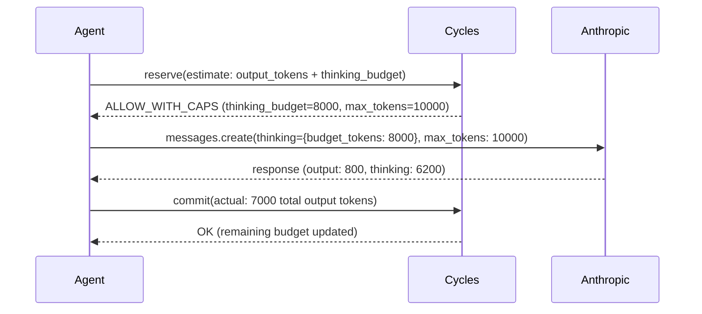

# Budgeting Reasoning Tokens: Governing Extended Thinking

A team migrated a triage agent from `claude-3-5-sonnet` to `claude-sonnet-4-6` with extended thinking enabled. Same prompts, same tools. They bumped `max_tokens` to 40,000 so the model would have room for chain-of-thought, accepted Anthropic's default `budget_tokens`, and deployed. The next morning's invoice was 7x higher. The visible answers looked identical — short, correct, on-topic. The difference was hidden from the user-facing UI: each call burned 18,000–32,000 thinking tokens that either never appeared in the app at all or were summarized away. Nobody had set a per-call thinking cap tied to the run's overall budget. The budget wasn't wrong. It was blind.

<!-- more -->

Reasoning models — Claude extended thinking (Sonnet/Opus 4.x), OpenAI o3, Gemini 2.5 thinking, DeepSeek R1 — have quietly invalidated a generation of agent cost controls. Each provider offers some per-call control (`budget_tokens` or adaptive `effort` on Anthropic, `reasoning.effort` on OpenAI, `thinkingBudget` on Gemini), but if your production budget layer was built around visible output tokens, prompt length, request count, or provider spending caps, none of those knobs plug into it. The result: you're enforcing a budget that bears only loose correlation to what you actually pay. This post shows why, and how to fix it with a runtime authority layer that caps thinking spend before the model runs.

## Why reasoning tokens break existing controls

Reasoning tokens have three properties that existing governance layers don't handle:

1. **They are billed as output tokens.** On Anthropic, thinking tokens are a subset of `max_tokens` and roll up into `usage.output_tokens`. On OpenAI o-series via the Responses API, they surface in `usage.output_tokens_details.reasoning_tokens` and count toward `max_output_tokens` (Chat Completions exposes the same values at `usage.completion_tokens_details.reasoning_tokens` / `max_completion_tokens`). On Gemini 2.5, Google returns them separately under `thoughts_token_count` but prices them at the output rate. DeepSeek R1 returns `reasoning_content` alongside `content`. You pay for them everywhere; whether you can see them in the response body depends on the provider.

2. **They can vary from a few hundred to tens of thousands of tokens per call.** OpenAI documents this range explicitly for o-series models, and the same shape shows up on Anthropic extended thinking and Gemini 2.5. The same prompt with the same model can produce a small amount of reasoning one time and a much larger amount the next, depending on question-difficulty heuristics the model chooses internally. Unlike visible output tokens, you cannot bound reasoning with a character-count estimate of the task.

3. **They are usually not surfaced to end users, even when the API returns them.** Your agent UI shows a clean four-sentence answer. Behind it, the model burned through 25,000 tokens of chain-of-thought the user never sees — whether the API hid the reasoning (Anthropic, OpenAI, Gemini) or returned it and your app stripped it (DeepSeek). Any observability dashboard that samples "response length" as a cost proxy will understate your real spend.

The practical consequence: `max_tokens` is now a cost cap in a way it never was before. In the pre-reasoning era, `max_tokens=4096` meant "at most 4096 tokens of visible output." Today, on a reasoning model, it means "at most 4096 tokens of *anything*, thinking included" — and if you set it too low, the model truncates mid-thought and returns an empty or garbage answer. If you set it high to be safe, you've silently uncapped per-call cost by 10x.

Rate limits are worse. A 10 requests-per-minute limit on an o3 agent can still produce $40/minute in reasoning spend, because the *per-request* cost is unbounded. Provider spending caps (OpenAI org limits, Anthropic workspace caps) trip at the end of the billing window — hours or days after the damage is done. See [why provider caps aren't enough](/blog/cycles-vs-llm-proxies-and-observability-tools) for more.

## The shape of the fix: separate caps, pre-flight reservation

Governing reasoning tokens requires three things existing budget layers don't provide:

- **A thinking budget distinct from output budget**, enforced at the provider API level via `budget_tokens` (Anthropic), `reasoning_effort` (OpenAI), or `thinkingBudget` (Gemini).
- **A pre-flight reservation** sized to the *worst-case* combined token count, not the expected output length.
- **Post-hoc reconciliation** that commits the actual thinking + output tokens against the reservation, so an agent that burns its thinking budget loses budget share from the run's overall cap.

This is the runtime authority pattern: reserve → enforce → commit. It's the same pattern we apply to tool risk, delegation chains, and retry storms. Reasoning tokens are simply another dimension of exposure. For the general pattern, see [exposure: why rate limits leave agents unbounded](/concepts/exposure-why-rate-limits-leave-agents-unbounded).

::: info Proposed Caps extension — not yet in the published protocol
The Cycles Caps schema at conformance target **v0.1.25** covers `max_tokens`, `max_steps_remaining`, `tool_allowlist`, `tool_denylist`, and `cooldown_ms`. The reasoning-specific fields used in the examples below (`thinking_tokens`, `reasoning_effort`, `max_output_tokens`) are a **proposed extension** that fits the existing reserve-commit surface — they're the natural shape the Caps bag would take once reasoning-model support lands in a future protocol revision. For today, you can thread the same values through reservation `metadata` and have your policy layer translate them into the existing `max_tokens` cap plus a provider-specific parameter at the application edge. The code below reads as "what the integration looks like when the protocol surfaces these caps natively."
:::



The key is that Cycles returns the **enforced thinking cap** as part of the decision — the agent doesn't choose it, the governance layer does, based on remaining budget, tenant tier, and tool risk class.

## Concrete integration: Claude extended thinking

Here's the integration for Anthropic's extended thinking API. Cycles acts as the authority that decides how much reasoning the agent can afford *for this particular call*. The code below uses the `runcycles` Python SDK's canonical surface — `CyclesClient` + `ReservationCreateRequest` — in the same shape the [delegation-chains post](/blog/agent-delegation-chains-authority-attenuation-not-trust-propagation) and [unit-economics post](/blog/ai-agent-unit-economics-cost-per-conversation-per-user-margin) use.

```python
from anthropic import Anthropic
from runcycles import (
    CyclesClient, CyclesConfig,
    ReservationCreateRequest, Action, Amount, Subject, Unit,
)

client = CyclesClient(CyclesConfig.from_env())
anthropic = Anthropic()

def run_reasoning_task(tenant_id: str, prompt: str, tool_risk: str):
    # Reserve worst-case: output tokens + thinking budget.
    # For a reasoning model, thinking is typically 3-10x expected output.
    worst_case_microcents = estimate_cost(
        output=2000, thinking=12000, model="claude-sonnet-4-6"
    )

    res = client.create_reservation(ReservationCreateRequest(
        subject=Subject(tenant=tenant_id, workflow="reasoning"),
        action=Action(kind="llm.reason", name="anthropic-thinking"),
        estimate=Amount(amount=worst_case_microcents, unit=Unit.USD_MICROCENTS),
        metadata={"tool_risk": tool_risk, "model": "claude-sonnet-4-6"},
    ))

    if res.decision == "DENY":
        raise BudgetExceeded(res.reason_code)

    # Cycles returns the thinking cap for THIS call via the ALLOW_WITH_CAPS path.
    caps = res.caps or {}
    thinking_budget = caps.get("thinking_tokens", 8000)
    max_tokens = caps.get("max_tokens", thinking_budget + 2000)

    try:
        response = anthropic.messages.create(
            model="claude-sonnet-4-6",
            max_tokens=max_tokens,
            thinking={"type": "enabled", "budget_tokens": thinking_budget},
            messages=[{"role": "user", "content": prompt}],
        )

        # Reconcile: commit what was actually burned.
        # Anthropic's usage.output_tokens already includes thinking tokens.
        actual_microcents = cost_from_tokens(
            input=response.usage.input_tokens,
            output=response.usage.output_tokens,
            model="claude-sonnet-4-6",
        )
        client.commit_reservation(
            reservation_id=res.reservation_id,
            actual=Amount(amount=actual_microcents, unit=Unit.USD_MICROCENTS),
        )
        return response

    except Exception:
        client.release_reservation(reservation_id=res.reservation_id)
        raise
```

Three things to note:

- **`thinking_budget` comes from Cycles, not the application.** A tenant on a lower tier gets a smaller cap. A high-risk tool gets a smaller cap. A run that has already consumed most of its overall budget gets a smaller cap. The agent code doesn't make this decision.
- **`max_tokens` must be ≥ `budget_tokens + expected_output`.** Anthropic requires this; Cycles enforces it by returning both values from `res.caps`. Set `max_tokens` too close to `budget_tokens` and the model will run out of budget for visible output.
- **Reconcile against `output_tokens`, not a separate thinking field.** Anthropic bills thinking as output. Your commit amount should treat them identically.

### Claude Opus 4.7 — adaptive thinking and task budgets

Opus 4.7 drops the manual `budget_tokens` knob. In its place, Anthropic introduced **adaptive thinking** — you pass `thinking: {"type": "adaptive"}` with an `output_config.effort` level and the model chooses how much to reason per call. For full agentic loops, Anthropic also added **task budgets** in beta, which cap total spend across a multi-turn run rather than per-call. Migrating the example above to Opus 4.7 means:

- Replace `thinking: {"type": "enabled", "budget_tokens": N}` with `thinking: {"type": "adaptive"}` + `output_config: {"effort": effort}`.
- Read `effort` from `res.caps` (same shape as the OpenAI path below — the governance layer maps tenant/tool/budget state to an effort level).
- For long-running agents, wrap multiple reservations under one task-budget ceiling so the reserve-commit loop sits inside Anthropic's task-budget window rather than fighting it.

The reserve → enforce → commit shape is unchanged; only the per-call parameter names move.

## The same pattern on OpenAI o-series

For OpenAI's reasoning models, there's no direct `budget_tokens` knob — you pick an effort level ("low", "medium", "high"; recent APIs also expose "minimal"), and reasoning tokens count toward `max_output_tokens`. OpenAI now recommends the **Responses API** for reasoning models (Chat Completions still works, but Responses is where new reasoning capabilities land). Cycles translates a thinking-token cap into an effort level and a ceiling:

```python
res = client.create_reservation(ReservationCreateRequest(
    subject=Subject(tenant=tenant_id, workflow="reasoning"),
    action=Action(kind="llm.reason", name="openai-o3"),
    estimate=Amount(
        amount=estimate_cost(output=2000, thinking=10000, model="o3"),
        unit=Unit.USD_MICROCENTS,
    ),
))

caps = res.caps or {}
effort = caps.get("reasoning_effort", "low")
max_output = caps.get("max_output_tokens", 12000)

response = openai.responses.create(
    model="o3",
    reasoning={"effort": effort},
    max_output_tokens=max_output,
    input=prompt,
)

# usage.output_tokens already includes the reasoning tokens
# (broken out in usage.output_tokens_details.reasoning_tokens).
# Billing and your commit amount should treat them identically.
client.commit_reservation(
    reservation_id=res.reservation_id,
    actual=Amount(
        amount=cost_from_tokens(
            input=response.usage.input_tokens,
            output=response.usage.output_tokens,
            model="o3",
        ),
        unit=Unit.USD_MICROCENTS,
    ),
)
```

The runtime authority layer absorbs the API differences. The agent code stays the same across providers — reserve, enforce caps the server returned, commit actuals.

## Thinking-to-output ratio as a governance signal

Once you're capturing thinking tokens on every call, a ratio emerges: thinking tokens ÷ visible output tokens. In traces from our own reasoning workloads, healthy calls tend to sit between **2:1 and 8:1** — your distribution will vary by prompt style and model, so measure yours before picking a threshold. Ratios above 15:1 are almost always one of:

- A prompt that confuses the model into over-deliberating
- A tool description that triggers exhaustive option enumeration
- A retry of an ambiguous task that the model can't resolve

Treat high thinking:output ratio as a first-class signal in your [observability setup](/how-to/observability-setup). In Cycles, you can attach the ratio as metadata on the commit and fire a webhook when it exceeds a threshold:

```python
# OpenAI Responses API path; Chat Completions uses
# usage.completion_tokens_details.reasoning_tokens and usage.completion_tokens.
reasoning_tokens = response.usage.output_tokens_details.reasoning_tokens
visible_tokens = response.usage.output_tokens - reasoning_tokens
ratio = reasoning_tokens / max(visible_tokens, 1)

client.commit_reservation(
    reservation_id=res.reservation_id,
    actual=Amount(amount=actual_microcents, unit=Unit.USD_MICROCENTS),
    metadata={"thinking_output_ratio": ratio},
)
```

Then alert on `ratio > 15` in your events subscriber. A prompt that keeps producing high ratios is a prompt that needs to be rewritten or a task that needs a smaller model — not a budget that needs raising.

## Concrete takeaway

On Monday morning, if your agents use Claude extended thinking, o3, Gemini 2.5 thinking, or DeepSeek R1:

1. **Audit one week of logs** for `usage.output_tokens_details.reasoning_tokens` (OpenAI Responses API; Chat Completions exposes `usage.completion_tokens_details.reasoning_tokens`) or the output/input token ratio (Anthropic). Find your current distribution.
2. **Set a per-call thinking cap** via `budget_tokens` or `reasoning_effort`. Start at the 80th percentile of your current distribution, not the max.
3. **Reserve worst-case, commit actuals.** Your reservation estimate must include thinking tokens at worst-case, or concurrent calls will breach the run-level cap. See the [exposure estimation guide](/how-to/how-to-estimate-exposure-before-execution-practical-reservation-strategies-for-cycles).
4. **Track thinking:output ratio per prompt template.** The ones above 15:1 are wasted spend, not deep thought.

Reasoning models moved the governance surface. The budget you enforce now has to see tokens the user never will. That's a runtime authority problem, not a dashboard problem. If you're still relying on `max_tokens` and provider caps, you're enforcing a budget that doesn't know what it's paying for.

Related reading:
- [Coding Agents Need Runtime Budget Authority](/concepts/coding-agents-need-runtime-budget-authority)
- [AI Agent Unit Economics: Cost per Conversation](/blog/ai-agent-unit-economics-cost-per-conversation-per-user-margin)
- [Why Rate Limits Are Not Enough for Autonomous Systems](/concepts/why-rate-limits-are-not-enough-for-autonomous-systems)
- [Exposure: Why Rate Limits Leave Agents Unbounded](/concepts/exposure-why-rate-limits-leave-agents-unbounded)

## References

- Anthropic: [Extended thinking documentation](https://docs.anthropic.com/en/docs/build-with-claude/extended-thinking) — `thinking.budget_tokens`, billing semantics, `max_tokens` > `budget_tokens` requirement
- Anthropic: [What's new in Claude Opus 4.7](https://platform.claude.com/docs/en/about-claude/models/whats-new-claude-4-7) — adaptive thinking, `output_config.effort`, task budgets
- OpenAI: [Reasoning guide](https://developers.openai.com/api/docs/guides/reasoning) — Responses API, `reasoning.effort`, `reasoning_tokens` in usage, `max_output_tokens`
- Google: [Understand and count tokens (Gemini API)](https://ai.google.dev/gemini-api/docs/tokens) — `thoughts_token_count` returned separately; output pricing includes thinking tokens
- DeepSeek: [R1 model card](https://api-docs.deepseek.com/guides/reasoning_model) — `reasoning_content` returned alongside `content`; both billed

## Related how-to guides

- [Webhook integrations](/how-to/webhook-integrations)
- [Using the Cycles dashboard](/how-to/using-the-cycles-dashboard)
- [Integrating with OpenAI](/how-to/integrating-cycles-with-openai)
