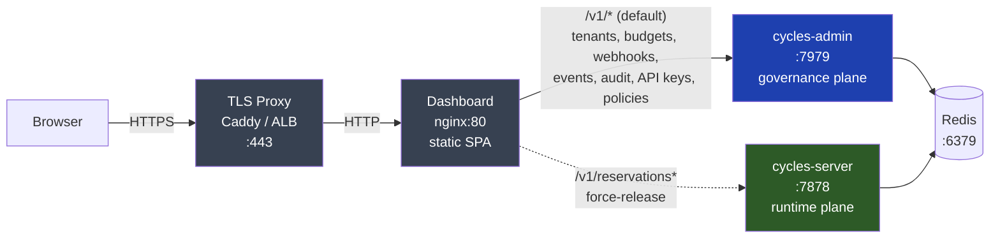

# Deploy the Cycles Admin Dashboard

The Cycles Admin Dashboard is a Vue 3 single-page app that sits in front of [`cycles-server-admin`](https://github.com/runcycles/cycles-server-admin) and provides an operations-oriented UI for tenants, budgets, webhooks, and incident response. It's a thin client — all state lives in the admin server; the dashboard just visualises it and calls admin API endpoints on your behalf.

<p align="center">
  
  <br/>
  <em>End-to-end walkthrough of the main operator flows</em>
</p>

::: info When to deploy the dashboard
If you only need SDK integration (Python, TypeScript, Spring, Rust, MCP), you can skip this page — the dashboard is optional. Deploy it when you want a UI for day-two operations: investigating events, freezing a runaway budget, rotating API keys, replaying missed webhooks, or force-releasing hung reservations during an incident.
:::

## What you get

A single pane for all operator tasks, capability-gated by the admin key:

| Page | Purpose |
|---|---|
| **Overview** | Single-request aggregated health dashboard — entity counts, top offenders, failing webhooks, over-limit scopes |
| **Tenants** | Tenant list + detail with budgets, API keys, and policies tabs |
| **Budgets** | Tenant-scoped budget list with utilization/debt bars; inline `RESET` and `RESET_SPENT` |
| **Events** | Correlation-first investigation tool with expandable detail rows |
| **API Keys** | Cross-tenant key list with masked IDs, permissions, status filters |
| **Webhooks** | Subscription health (green/yellow/red) + delivery history, replay, test |
| **Reservations** | Hung-reservation force-release during incident response (runtime-plane admin-on-behalf-of) |
| **Audit** | Compliance query tool with CSV/JSON export |

Incident-response actions (freeze budget, suspend tenant, revoke API key, pause webhook, force-release reservation, emergency tenant-wide freeze) are one-click with confirmation and blast-radius summaries.

## Architecture

The dashboard is a static SPA served by nginx. It talks to **two backends** — the governance plane (`cycles-server-admin`) for tenants, budgets, policies, webhooks, events, and audit; and the runtime plane (`cycles-server`) for reservation force-release during incident response. Both are reverse-proxied through the dashboard's own nginx so the browser sees everything as same-origin and CORS is not involved in a standard production deployment.



The solid path carries every dashboard page except Reservations. The dotted path carries runtime-plane force-release calls issued from the Reservations page during incident response.

The nginx routing split in `nginx.conf`:

| Request path | Upstream | Used by |
|---|---|---|
| `/v1/reservations*` | `cycles-server:7878` | Reservations page — force-release hung reservations (runtime-plane admin-on-behalf-of) |
| `/v1/*` (everything else) | `cycles-admin:7979` | All other dashboard pages |

Both backends authenticate the same `X-Admin-API-Key` header. On the runtime plane, force-release is a dual-authenticated admin-on-behalf-of call — the runtime server validates the admin key and records the actor in the audit trail.

## Quick start (development)

For local development against a running admin server:

```bash
git clone https://github.com/runcycles/cycles-dashboard.git
cd cycles-dashboard
npm install
npm run dev
```

Dashboard opens at `http://localhost:5173`. The Vite dev server mirrors the production routing split:

- `/v1/reservations*` → `localhost:7878` (`cycles-server` — runtime plane)
- `/v1/*` (everything else) → `localhost:7979` (`cycles-admin` — governance plane)

**You need both backends running.** See [Deploy the Full Stack](/quickstart/deploying-the-full-cycles-stack) to bring them up — or `cd ../cycles-server-admin && ADMIN_API_KEY=your-key docker compose up -d` if you only want admin + Redis and plan to run `cycles-server` separately. Log in with the same `ADMIN_API_KEY` you set on the servers (both admin and runtime must share the same key for force-release to work).

::: tip CORS for dev mode
If the admin or runtime server rejects your dev browser with a CORS error, set `DASHBOARD_CORS_ORIGIN=http://localhost:5173` on **both** containers. (In production with the nginx reverse proxy, CORS is not needed — the dashboard's nginx makes every backend call same-origin.)
:::

## Production (Docker + Caddy)

Recommended production setup uses Caddy for automatic HTTPS. Only ports 443 and 80 are exposed; admin server and Redis stay on the internal Docker network.

```yaml
# docker-compose.prod.yml
services:
  caddy:
    image: caddy:2-alpine
    restart: unless-stopped
    ports:
      - "443:443"
      - "80:80"
    volumes:
      - ./Caddyfile:/etc/caddy/Caddyfile
      - caddy-data:/data
    depends_on:
      - dashboard
    networks:
      - cycles

  dashboard:
    image: ghcr.io/runcycles/cycles-dashboard:0.1.25.27
    restart: unless-stopped
    # No exposed ports — only reachable through Caddy.
    depends_on:
      cycles-admin:
        condition: service_healthy
      cycles-server:
        condition: service_healthy
    networks:
      - cycles

  # Runtime plane — reservation force-release goes here via /v1/reservations*.
  # Its ADMIN_API_KEY must match cycles-admin's so admin-on-behalf-of calls
  # authenticate on both sides.
  cycles-server:
    image: ghcr.io/runcycles/cycles-server:0.1.25.8
    restart: unless-stopped
    environment:
      REDIS_HOST: redis
      REDIS_PORT: 6379
      REDIS_PASSWORD: ${REDIS_PASSWORD:-}
      ADMIN_API_KEY: ${ADMIN_API_KEY:?ADMIN_API_KEY must be set}
      DASHBOARD_CORS_ORIGIN: ${DASHBOARD_ORIGIN:-https://admin.example.com}
    healthcheck:
      test: ["CMD", "wget", "--spider", "-q", "http://localhost:7878/actuator/health"]
      interval: 10s
      timeout: 5s
      retries: 3
      start_period: 30s
    depends_on:
      redis:
        condition: service_healthy
    networks:
      - cycles

  # Governance plane — tenants, budgets, policies, webhooks, events, audit.
  cycles-admin:
    image: ghcr.io/runcycles/cycles-server-admin:0.1.25.18
    restart: unless-stopped
    environment:
      REDIS_HOST: redis
      REDIS_PORT: 6379
      REDIS_PASSWORD: ${REDIS_PASSWORD:-}
      ADMIN_API_KEY: ${ADMIN_API_KEY:?ADMIN_API_KEY must be set}
      WEBHOOK_SECRET_ENCRYPTION_KEY: ${WEBHOOK_SECRET_ENCRYPTION_KEY:-}
      DASHBOARD_CORS_ORIGIN: ${DASHBOARD_ORIGIN:-https://admin.example.com}
      EVENT_TTL_DAYS: ${EVENT_TTL_DAYS:-90}
      DELIVERY_TTL_DAYS: ${DELIVERY_TTL_DAYS:-14}
    healthcheck:
      test: ["CMD", "wget", "--spider", "-q", "http://localhost:7979/actuator/health"]
      interval: 10s
      timeout: 5s
      retries: 3
      start_period: 30s
    depends_on:
      redis:
        condition: service_healthy
    networks:
      - cycles

  redis:
    image: redis:7-alpine
    restart: unless-stopped
    command: redis-server --appendonly yes --requirepass ${REDIS_PASSWORD:-}
    volumes:
      - redis-data:/data
    healthcheck:
      test: ["CMD", "redis-cli", "ping"]
      interval: 5s
      timeout: 3s
      retries: 5
    networks:
      - cycles

volumes:
  redis-data:
  caddy-data:

networks:
  cycles:
```

::: warning Both backends required
The dashboard's nginx routes `/v1/reservations*` to `cycles-server:7878` for the Reservations page's force-release action. If you omit `cycles-server`, every other page works but force-release fails with a 502. The `ADMIN_API_KEY` **must be the same** on both `cycles-admin` and `cycles-server` — admin-on-behalf-of calls authenticate on both sides.
:::

```
# Caddyfile
admin.example.com {
    reverse_proxy dashboard:80
}
```

Deploy:

```bash
cat > .env << 'EOF'
ADMIN_API_KEY=$(openssl rand -base64 32)
REDIS_PASSWORD=$(openssl rand -base64 32)
WEBHOOK_SECRET_ENCRYPTION_KEY=$(openssl rand -base64 32)
EOF

docker compose -f docker-compose.prod.yml up -d
```

Open `https://admin.example.com`, log in with the generated `ADMIN_API_KEY`.

::: warning Admin API key is the only credential
The dashboard uses `X-Admin-API-Key` exclusively for authentication. There is no user login, no SSO out of the box. **Treat the admin key as a root credential** — rotate it regularly, store it in a secrets manager, and consider placing the dashboard behind SSO or VPN for defense in depth.
:::

## Authentication and session handling

1. User enters the admin API key on the login page.
2. Dashboard calls `GET /v1/auth/introspect` to validate and retrieve capabilities.
3. Sidebar navigation is gated by capability booleans (`view_overview`, `view_budgets`, etc.) — the admin server decides what's visible.
4. On 401/403 from any API call, the session is cleared and the user is redirected to login.
5. Key is stored in `sessionStorage` — survives page refresh, cleared on tab/browser close. Never written to `localStorage` or cookies.
6. Session idle timeout (30 min) and absolute timeout (8 h) enforced client-side, checked every 15 s.
7. Login rate limiting — exponential backoff after 3 failed attempts (5 s → 10 s → 20 s → 40 s → 60 s cap).

## Polling cadence

Each page manages its own polling lifecycle via a `usePolling` composable. Intervals are tuned per page — most default to 60 s; Events polls more aggressively, Audit not at all.

| Page | Interval | Behaviour |
|---|---|---|
| Overview | 30 s | Pause on tab hidden, 2× backoff on error (max 5 min) |
| Events | 15 s | Same |
| Budgets | 60 s | Same |
| Webhooks | 60 s | Same |
| Tenants | 60 s | Same |
| Audit | Manual only | Explicit "Run Query" button |

## Hardening checklist

- **Never expose ports 7878, 7979, or 6379** to the public internet. Only the TLS proxy (443/80) should be reachable; the runtime, admin, and Redis containers must stay on the internal Docker network.
- **HTTPS only** — the admin key is sent on every request. Caddy or a load balancer with TLS 1.2+ in front.
- **Rotate the admin key** periodically (`openssl rand -base64 32`).
- **Set `REDIS_PASSWORD`** — the default has no authentication.
- **Store secrets in a secrets manager** (Vault, AWS Secrets Manager, etc.), not in git or `.env` files committed to the repo.
- **Subresource Integrity (SRI)** hashes are baked into all production assets via `vite-plugin-sri-gen`.
- Default `nginx.conf` ships with `X-Frame-Options: DENY`, `X-Content-Type-Options: nosniff`, CSP, Permissions-Policy, and `server_tokens off`. The TLS variant adds HSTS.

## Monitoring

- Admin server exposes `/actuator/health` — use for liveness checks.
- `GET /v1/admin/overview` is a good synthetic monitoring target — if it returns 200, the full stack (Redis + admin + auth) is working.
- Alert on the overview payload's `failing_webhooks` and `over_limit_scopes` arrays.
- For deeper metric-based alerting, see [Observability Setup](/how-to/observability-setup) and [Monitoring and Alerting](/how-to/monitoring-and-alerting).

## Environment variables

| Variable | Required | Default | Description |
|---|---|---|---|
| `ADMIN_API_KEY` | Yes | — | Admin API key for `X-Admin-API-Key`. **Must be the same value on `cycles-admin` and `cycles-server`** — admin-on-behalf-of calls (force-release reservation) authenticate on both. |
| `REDIS_PASSWORD` | Recommended | (empty) | Redis authentication password |
| `WEBHOOK_SECRET_ENCRYPTION_KEY` | Recommended | (empty) | AES-256-GCM key for webhook signing secrets at rest |
| `DASHBOARD_CORS_ORIGIN` | Dev only | `http://localhost:5173` | CORS origin — only needed when the browser calls the admin server directly (dev mode); unused in standard production |

The dashboard itself has no server-side configuration — it's a static SPA. The admin server URL is set by the proxy:
- **Development:** Vite proxy in `vite.config.ts` (default: `localhost:7979`).
- **Production:** nginx reverse proxy in `nginx.conf` (default: `cycles-admin:7979`).

## Next steps

- [Deploy the Full Stack](/quickstart/deploying-the-full-cycles-stack) — bring up admin + runtime + events alongside the dashboard
- [Admin API reference](/admin-api/) — the endpoints the dashboard calls
- [Observability Setup](/how-to/observability-setup) — Prometheus scrape + `cycles_*` metrics
- [Monitoring and Alerting](/how-to/monitoring-and-alerting) — alert rules using the `cycles_*` counters

## Source

- Repository: [`runcycles/cycles-dashboard`](https://github.com/runcycles/cycles-dashboard)
- Image: `ghcr.io/runcycles/cycles-dashboard`
- Stack: Vue 3 + TypeScript + Vite, Pinia, Vue Router, Tailwind CSS v4. Tests: Vitest (unit) + Playwright (E2E against the live compose stack).
- License: Apache 2.0
